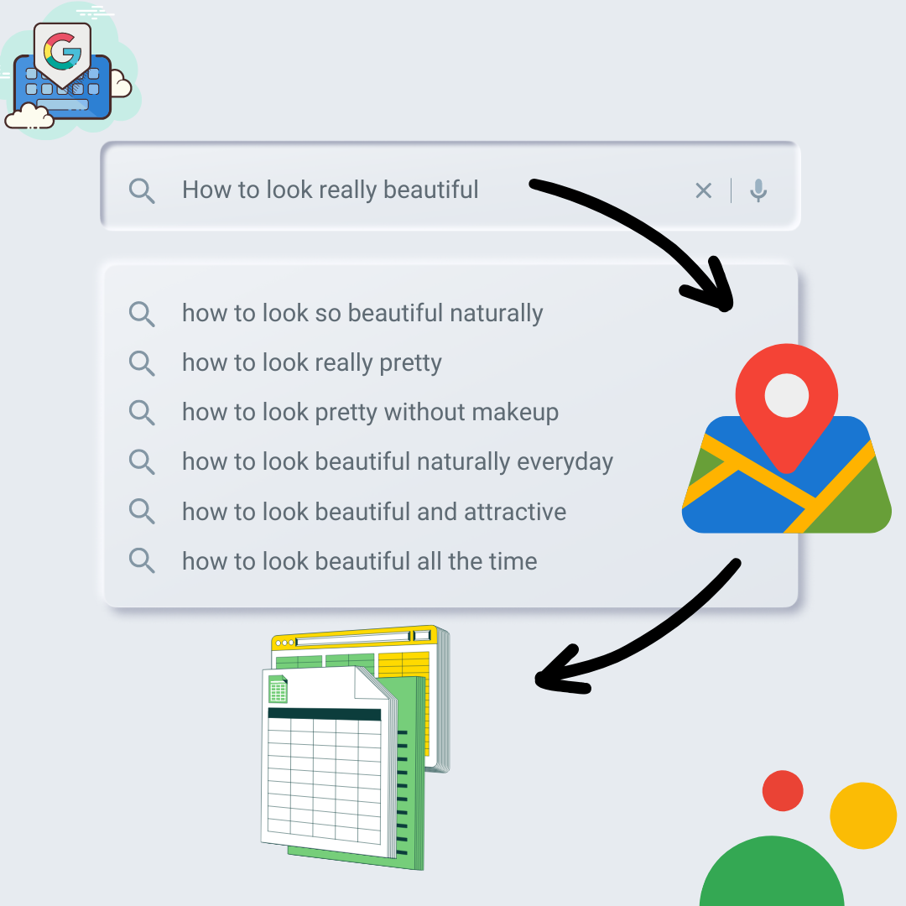

# data2sheet
### using the OAuth 2.0 authorization flow to authenticate and access Google Sheets.

    
     
    figure is provided by 陳佳俊
    

It is **authored by** [**陳佳俊**](https://github.com/jerryboy1031). It is **maintained by** [**陳佳俊**](https://github.com/jerryboy1031).

## Contents
1. [Results](#results)
2. [Features](#features)
3. [Contributors](#contributors)
4. [Installation](#installation)
5. [Send Us Feedback!](#send-us-feedback)
6. [License](#license)

## Results

- access some information about a location

    
     
    figure is provided by 陳佳俊
    

## Features

1. Install the necessary libraries:
- Install the gspread library using pip install gspread.
- Install the oauth2client library using pip install oauth2client.
2. Authenticate and access Google Sheets:
- Follow the steps to create a client secret file:
  
  -  Go to the Google Developers Console (console.developers.google.com).
  - Create a new project (if not already created).
  - Enable the Google Sheets API for your project.
  - Create OAuth 2.0 credentials (Client ID and Client Secret).
  - Download the client secret JSON file.
- Use the gspread library and the OAuth 2.0 flow to authenticate and access Google Sheets

## Contributors
- [**陳佳俊**](https://github.com/jerryboy1031)

## Installation
- required Python modules:
1. gspread
2. google.oauth2.service_account

install by `pip install ...`

- create multiple goolge API on:
[**google cloud platform**](https://console.cloud.google.com/apis/credentials?hl=zh-tw&project=web-scraping20230703)

## Send Us Feedback!
Our library is open source for research purposes, and we want to improve it! So let us know (create a new GitHub issue or pull request, email us, etc.) if you...
1. Find/fix any bug (in functionality or speed) or know how to speed up or improve any part of this project.
2. Want to add/show some cool functionality/demo/project made on top of it. We can add your project link to our project.

## License
OpenPose is freely available for free non-commercial use, and may be redistributed under these conditions. Please, see the [license](./LICENSE) for further details.
